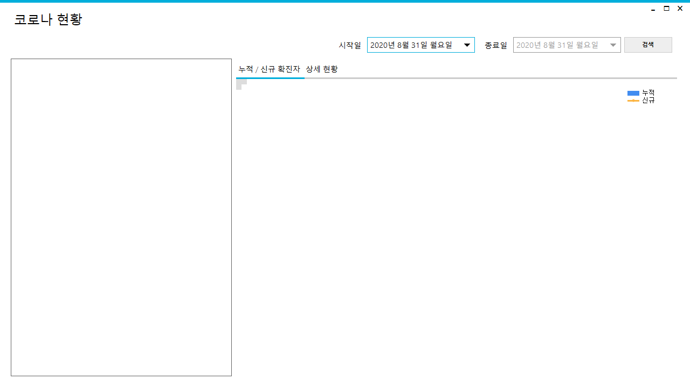
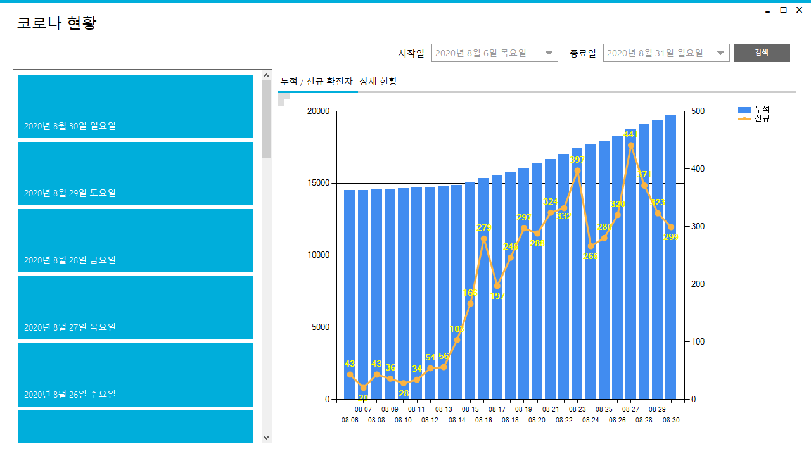
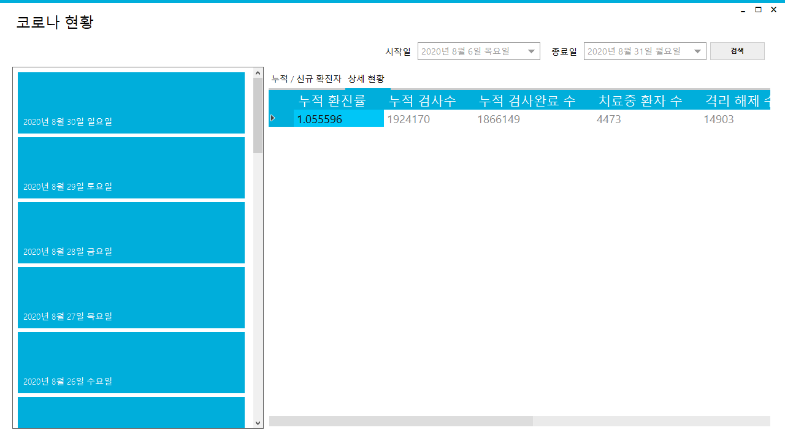

# Covid19_OpenAPI
OpenAPI를 활용한 코로나19 기간 누적확진자, 신규확진자 조회 및 상세정보조회

## 개요
- 해당 프로그램은 코로나19 현황 확인프로그램으로 기간 누적확진자, 신규확진자 조회, 상세정보조회로 구성되어있다.
- 누적확진자, 신규확진자 조회는 Chart를 활용해 한눈에 보이게 한다.
- 좌측 List에 있는 Tile을 클릭하면 해당하는 날짜의 상세정보를 확인할수있다.

### 사용도구
- C# Winform
- MetroUI https://www.nuget.org/packages/MetroModernUI/
- 공공데이터 포털 코로나19 API ( XML ) https://www.data.go.kr/data/15043376/openapi.do

## 메인화면

## 기간조회

## 상세조회

